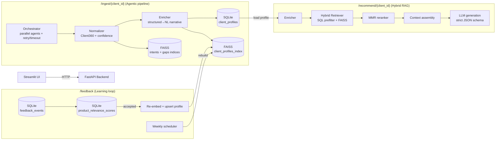

# Architecture & Pipeline (Agentic RAG / LLM-specific)

This document describes the **agentic AI / RAG / LLM pipeline** implemented in this repository (current version), focusing on:

- **Agent orchestration** (parallel execution + retry + timeouts)
- **LLM provider fallback** (OpenAI primary → Groq fallback, runtime switching)
- **Embedding provider fallback** (OpenAI embeddings → local sentence-transformers)
- **Hybrid retrieval** (structured SQL pre-filter + vector search + MMR)
- **Grounded generation** (strict JSON output, context assembly)
- **Feedback loop** (event capture, relevance scoring, FAISS refresh, scheduled rebuild)

Codebase root: `banking-intelligence/`

---

## System components

### Services

- **Backend (FastAPI)**: `backend/main.py`
  - Runs pipeline ingestion (`/ingest/{client_id}`)
  - Serves profile (`/profile/{client_id}`)
  - Serves recommendations (`/recommend/{client_id}`)
  - Accepts feedback (`/feedback`)
  - Loads and persists state: SQLite + FAISS

- **Frontend (Streamlit)**: `frontend/app.py`
  - UI over backend endpoints
  - Requires `API_BASE` to point to the backend (Compose sets it to `http://backend:8000`)

### Persistent stores (prototype-grade)

- **SQLite** (async SQLAlchemy): `backend/storage/sql_store.py`
  - Primary truth for structured Client 360 profile, feedback events, and per-product scores

- **FAISS** (LangChain community vector store): `backend/rag/vector_store.py`
  - Persists 3 indices:
    - `client_profiles_index` (enriched profile text)
    - `intents_index` (per-intent mini docs)
    - `product_gaps_index` (gap summaries)

### Model selection (LLM + embeddings)

- **Chat model factory**: `backend/llm/llm_factory.py`
  - Primary: OpenAI `gpt-4o` if `OPENAI_API_KEY` exists
  - Fallback: Groq `llama-3.3-70b-versatile` if `GROQ_API_KEY` exists
  - **Runtime fallback wrapper**: if the primary model throws *any exception* at call time, the request is retried on the fallback model.

- **Embeddings factory**: `backend/rag/embeddings.py`
  - Primary: OpenAI `text-embedding-3-small` (1536 dims)
  - Fallback: HuggingFace `sentence-transformers/all-MiniLM-L6-v2` (384 dims, local CPU)

**Critical constraint**: FAISS indices are not compatible across embedding dimension changes. If you switch embedding providers, delete the FAISS directory (default `./data/faiss_index/`) and rebuild by re-ingesting.

---

## High-level flow (end-to-end)

---

## Backend lifecycle (what happens on startup)

FastAPI uses a lifespan context manager in `backend/main.py`:

1. **Initialize database**: `await sql_store.init_db()`
2. **Load FAISS indices**: `get_vector_store().load_all()`
3. **Warm up LLM**: `get_llm()` builds the best available provider (OpenAI/Groq)
4. **Start scheduler**: `start_scheduler()` schedules weekly FAISS rebuild

This is important for an agentic/RAG system because it ensures:

- retrieval is available before serving requests,
- LLM misconfiguration is detected early,
- state is consistent across requests (singletons for embeddings/vector store/LLM).

---

## Pipeline 1: Ingestion (agentic Client 360 build)

Endpoint: `POST /ingest/{client_id}`

### 1) Orchestration model

Orchestrator: `backend/pipeline/orchestrator.py`

- Runs agents with:
  - **parallelism** (Phase 1 agents run concurrently)
  - **timeouts** (`AGENT_TIMEOUT = 30s`)
  - **retries** (`MAX_RETRIES = 3`) with exponential backoff (`BACKOFF_BASE ** attempt`)
  - **partial failure tolerance** (pipeline can succeed with missing agents)

Phase design:

- **Phase 1 (concurrent)**:
  - `transaction_agent`
  - `crm_agent`
  - `interaction_agent`
- **Phase 2 (dependent)**:
  - `product_agent` uses partial output from Transaction + CRM to find similar clients and gaps

### 2) The agents (tool-calling + structured outputs)

Each agent is a LangChain tools agent that:

- has a fixed toolset (`@tool` functions)
- is prompted to use tools in a particular sequence
- returns a JSON object which is parsed into a Pydantic schema

#### Transaction Agent
File: `backend/agents/transaction_agent.py`

- Tools:
  - `load_transactions` (CSV → JSON; generates synthetic records if CSV missing)
  - `categorize_transactions`
  - `aggregate_monthly`
  - `detect_patterns` (trend, anomalies, international usage, top categories)
- Output: `TransactionOutput`
- Confidence: computed from unique months of data (prototype heuristic)

#### CRM Agent
File: `backend/agents/crm_agent.py`

- Tools:
  - `load_crm_record` (CSV → JSON; synthetic fallback)
  - `standardize_fields` (normalization + age band inference)
  - `infer_missing` (PIN → city inference + source tagging)
  - `flag_stale_fields` (>2 years old → stale fields list)
  - `resolve_duplicates` (placeholder in this version)
- Output: `CRMOutput`
- Confidence: penalized for stale fields and inferred city

#### Interaction Agent (LLM extraction for unstructured notes)
File: `backend/agents/interaction_agent.py`

- Purpose: convert noisy relationship-manager notes into structured signals:
  - summary
  - sentiment
  - intents (typed, confidence-scored)
  - life events
  - churn risk
  - signal quality

- Tools:
  - `load_interactions`
  - `preprocess_text` (PII-like regex removal + lightweight dedup)
  - `extract_signals` (prepares combined note text for extraction)
  - `validate_output` (best-effort schema correction)

- Prompt template: `backend/llm/prompts.py` → `INTERACTION_EXTRACTION_PROMPT`
  - Strong instruction to return **JSON only** (no markdown)
  - Contains a schema and few-shot examples

#### Product Agent (collaborative filtering + product gaps)
File: `backend/agents/product_agent.py`

- Purpose: detect “gaps” = products held by similar clients but not by current client.
- Tools:
  - `load_all_profiles` (loads stored profiles from SQL)
  - `find_similar_clients` (simple cosine similarity on a small feature vector)
  - `detect_product_gaps` (adoption threshold \(>\) 40%)
  - `score_gaps` (heuristic relevance score)

### 3) Normalization (source priority + unified schema)

Normalizer: `backend/pipeline/normalizer.py`

Key behaviors:

- **Source priority rules**, e.g.:
  - income band: CRM declared > transaction inferred > default
  - risk profile: CRM only (never inferred)
- **Confidence merge**: weighted average across agent confidence scores
  - weights: transaction 0.35, CRM 0.30, interaction 0.25, product 0.10

### 4) Enrichment (structured → narrative for RAG)

Enricher: `backend/pipeline/enricher.py`

Produces a compact natural-language profile summary using:

- template `ENRICHMENT_TEMPLATE` in `backend/llm/prompts.py`
- an automatic disclaimer when confidence < 60%

This enriched text is the **canonical “embed me” representation** for FAISS.

### 5) Persistence (SQL + FAISS)

Within the ingest endpoint (`backend/main.py`):

- Upsert profile to SQLite: `sql_store.upsert_client_profile(profile_dict)`
- Upsert into FAISS:
  - profile narrative into `client_profiles_index`
  - intents into `intents_index`
  - product gaps into `product_gaps_index`
- Save indices: `store.save_all()`

---

## Pipeline 2: Hybrid Retrieval (similar client context)

Core modules:

- Retriever: `backend/rag/retriever.py`
- Vector store: `backend/rag/vector_store.py`
- Reranker: `backend/rag/reranker.py`

Steps:

1. **Structured pre-filter** in SQL (`sql_store.filter_profiles`)
   - optional constraints: income band / churn risk / city
   - excludes the current `client_id` so you retrieve “similar others”

2. **Vector similarity search** over FAISS enriched profiles
   - FAISS does not natively filter by metadata in this implementation, so filtering is done as a post-step.

3. **Diversity selection**
   - `hybrid_retrieve` does a simple unique-client de-dup
   - then `mmr_rerank` applies MMR using embeddings computed on-the-fly (query + doc contents)

4. **Context assembly**
   - `assemble_context(docs)` concatenates docs into a single string with “Similar Client N — <id>” headers

This context is passed to the generation prompt so the LLM can ground recommendations in patterns observed across similar clients.

---

## Pipeline 3: Grounded Generation (LLM JSON output)

Generator: `backend/llm/generator.py`

Key features:

- Uses an LCEL chain: `ChatPromptTemplate` → `LLM` → `StrOutputParser`
- Strict instruction to output **valid JSON** matching a schema
- Extracts the JSON object using a regex and parses it
- Hard-limits to:
  - up to 3 recommendations
  - up to 3 talking points

Prompt: `backend/llm/prompts.py` → `RECOMMENDATION_PROMPT`

Grounding rules in this version:

- “Ground every recommendation in the client data”
- “Never recommend a product the client already holds”
- If confidence < 60%, prefix recommendations with “Based on available data, …”

---

## Pipeline 4: Feedback loop (learning + index refresh)

Feedback processing: `backend/feedback/feedback_loop.py`

1. **Record feedback event** in SQLite (`feedback_events`)
2. **Update relevance scores** in SQLite (`product_relevance_scores`)
   - accepted: increment + acceptance_count
   - rejected: decrement + rejection_count; flag for review after 3 rejections
3. **Refresh embeddings after acceptance**
   - reconstruct `Client360Profile` from SQL
   - enrich → embed → upsert into FAISS

### Scheduled maintenance: weekly rebuild

On startup, APScheduler registers:

- `weekly_rebuild` every Sunday at 02:00

This rebuilds FAISS from all SQL profiles (best effort), which is a common pattern in RAG systems:

- indexes can drift or corrupt in prototypes
- batch rebuild makes correctness easier than perfect incremental updates

---

## Observability: agent-level usage (LLM + tools)

Usage callback: `backend/observability/usage_logger.py`

What it tracks (best-effort, provider-dependent):

- per-agent:
  - LLM call count
  - tool call count
  - prompt/completion/total tokens when available
  - Groq “try again in …” parsing to log a refresh timestamp

The orchestrator sets the active agent name using a `ContextVar` (`current_agent`) so token usage can be attributed to the agent that caused it.

---

## Important RAG/Agentic constraints in this version

- **Vector-store truth vs SQL truth**:
  - SQL is the structured source of truth.
  - FAISS holds derived embeddings of the enriched text; it must be rebuilt if embeddings change.

- **Embedding dimension lock-in**:
  - OpenAI embeddings (1536 dims) and MiniLM embeddings (384 dims) cannot share indices.

- **Tool-calling “agentic” boundary**:
  - These agents are agentic primarily in the **tool selection and sequencing** sense.
  - Tools are local Python functions (CSV loads, transforms, heuristics), so determinism is higher than external toolchains.

- **Grounding limits**:
  - “Grounded” here means *prompt-level grounding* via retrieved context + strict formatting rules.
  - There is no separate citation/attribution subsystem yet.

